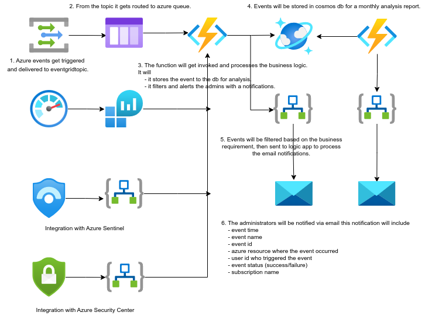

# VICGOV - Azure Active Directory Roles report
## 1. Introduction
### 1.1	Overview

A number of challenges arise when managing AAD roles across multiple tenants, Hosting Services team have been working to make this process easier to maintain with less administrative overhead.

This document is intended to provide a high level overview of workflow on how the automation notifies the admins with Azure AD roles assigned to non CTX staff in VICGOV.

Included in this report is a step by step detailed guide around where to look for troubleshooting.

## 2 Logical Architecture
### 2.1	Logical System Component Overview

1. Scheduled Job @ 7am on Friday.
2. Function retreives the secrets from the Keyvault.
3. Queries AAD for validating managed identity.
4. Checks AAD for the assigned roles.
5. The notification email gets sent via logic apps with the report attached.