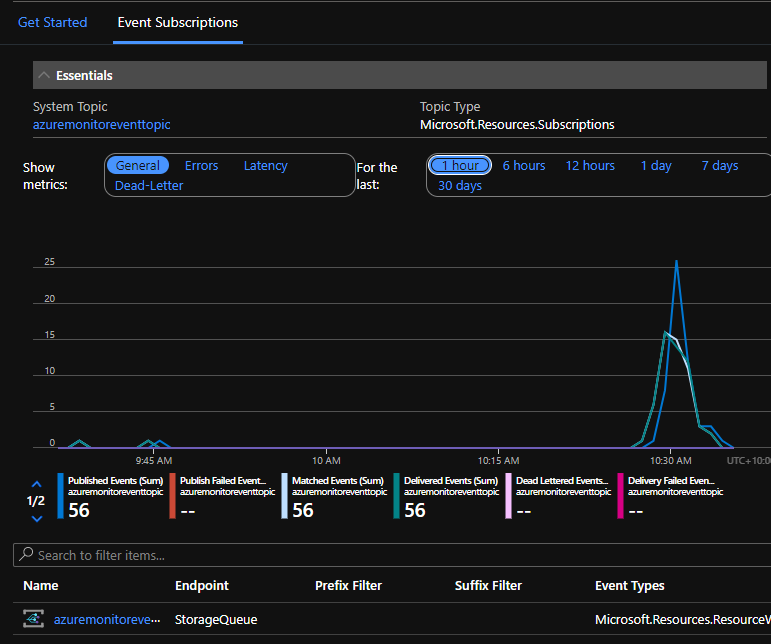
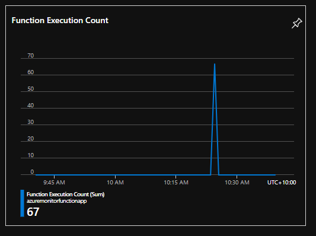
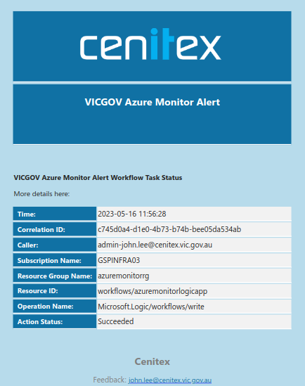
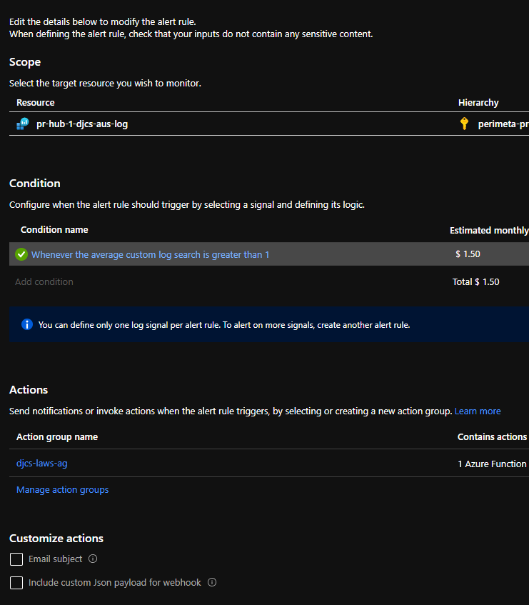

# VICGOV - Azure Alert, Monitor, Report Workflow

## Table of Contents
1. [Introduction](#1-introduction)
   1. [Overview](#11-overview)
2. [Logical Architecture](#2-logical-architecture)
   1. [Logical System Component Overview](#21-logical-system-component-overview)

## 1. Introduction
### 1.1 Overview

The VICGOV - Azure Alert, Monitor, Report Workflow was developed to improve the cloud monitoring solution and address various issues. This document provides a high-level overview of the workflow for capturing events and sending out notifications. It also includes a detailed troubleshooting guide.

## 2. Logical Architecture
### 2.1 Logical System Component Overview

The logical architecture of the VICGOV - Azure Alert, Monitor, Report Workflow is as follows:

1. Azure events are triggered and delivered to an event grid topic.
   - 

2. Events from the topic are routed to an Azure queue.
   - 

3. A function is invoked to process the business logic. It performs the following actions:
   - Stores the event in a database for analysis.
   - Filters and alerts the admins with notifications.
   - 

4. Events are stored in Cosmos DB for a monthly analysis report.
   - 

5. Events are filtered based on business requirements and sent to a logic app for processing email notifications.
   - 

6. Administrators are notified via email, which includes the following information:
   - Event time
   - Event name
   - Event ID
   - Azure resource where the event occurred
   - User ID who triggered the event
   - Event status (success/failure)
   - Subscription name
   - 

7. Azure Monitor runs KQL queries to check the log analytics workspace for VM metrics.
   - 

8. If the threshold is exceeded, it invokes the function for further processing.
   - 

9. The function is triggered for processing.

